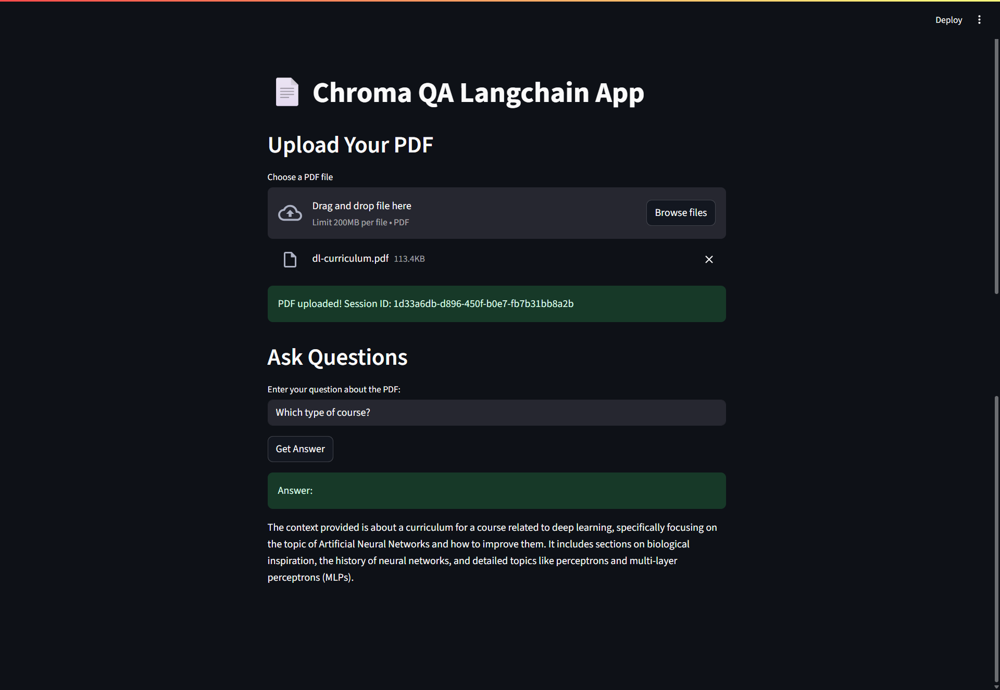

# 🧠 Chroma QA Langchain App

A powerful, multi-user Question Answering (QA) application built using **LangChain**, **Chroma Vector Store**, **FastAPI**, and **Streamlit**. Users can upload their own PDF files and ask context-aware questions — each session is isolated to ensure answers come only from the user's document.

---

## 🚀 Features

- 📄 **Upload PDF** and automatically extract content.
- 🔍 **Ask questions** from your uploaded document.
- 🗂️ **User session isolation** with per-user Chroma collections.
- 🧠 Powered by **OpenAI GPT-4o** and **text-embedding-3-large**.
- ⚡ FastAPI backend + Streamlit UI.

---

## 🖥️ UI Preview



---

## 🧩 Tech Stack

| Layer     | Technology                    |
| --------- | ----------------------------- |
| Backend   | FastAPI, LangChain, ChromaDB  |
| LLM       | OpenAI GPT-4o                 |
| Embedding | OpenAI text-embedding-3-large |
| Frontend  | Streamlit                     |
| Storage   | Chroma Vector Store           |

---

## 📦 Installation

1. **Clone the Repo**

```bash
git clone https://github.com/OneSakib/chroma-qa-langchain.git
cd chroma-qa-langchain
```
